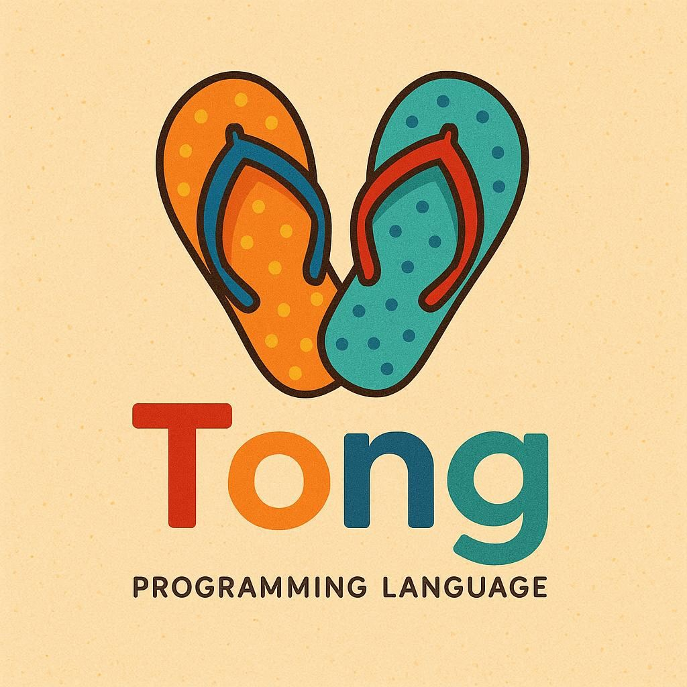

# TONG Programming Language

[](https://github.com/amilto-com/Tong/actions/workflows/ci.yml)

<p align="center">
    
</p>

The ultimate programming language designed for high‑performance parallel and distributed computing across heterogeneous environments (CPU/GPU/NPU/FPGA).

Authored by William Gacquer — AMILTO

Contributions welcome! See “Contributing” below.

## Why the name “TONG”?

We wanted a name that’s short, fun, and nerd‑accurate:

- It sounds like “tongue,” which you use for speaking a language — perfect for a programming language. Linguists, you’re welcome.
- In French, “une bascule (T flip‑flop)” is colloquially referred to as a “T(ong)” style flip‑flop — the simplest building block of memory in digital hardware. TONG pays homage to that first tiny bit of “remembering” your computer ever did.
- It’s easy to say, hard to forget, and looks great in monospace.

Conclusion: TONG is a language that speaks performance and remembers what matters.

## Features

🚀 **High Performance**
- Zero-cost abstractions
- Automatic parallelization for large datasets
- Memory safety without garbage collection overhead
- JIT compilation in REPL mode

⚡ **Heterogeneous Computing**
- Clear path toward CPU/GPU/NPU/FPGA execution
- Automatic workload distribution (progressive rollout)
- GPU kernel compilation (design underway)
- Distributed computing primitives (incremental)

🔧 **Developer Experience**
- Interactive REPL with hot compilation
- Modern syntax combining best of all languages
- Comprehensive error messages
- Built-in parallel algorithms

🌐 **Compilation Targets**
- Interpreter today, with compilation paths on the roadmap:
    - Native (x86_64/ARM64/RISC‑V)
    - WebAssembly (WASM)
    - GPU shaders (CUDA/OpenCL/Metal)
    - FPGA HDL

## Quick Start

### Installation

Clone the repository:

```bash
git clone https://github.com/amilto-com/Tong.git
cd Tong
```

Install Rust (if you don't have it): https://rustup.rs

Optional: add a convenient “tong” command to your PATH

- macOS/Linux:
    ```bash
    ./setup.sh --global
    ```
- Windows (PowerShell, no admin required):
    ```powershell
    ./setup.ps1 -Global
    ```

### Running TONG

```bash
# From the Rust crate directory
cd rust/tong

# Run a TONG program
cargo run -- ../../examples/hello.tong

# Build a release binary
cargo build --release

# After running setup.sh --global or setup.ps1 -Global
tong ../../examples/hello.tong
 
Windows (SDL3 example):
- The SDL3 backend is optional. To run the SDL Pong example with a real window, build with the feature and ensure `SDL3.dll` is available at runtime.
- Recommended options:
    - Place `SDL3.dll` next to the built binary (e.g., `rust/tong/target/debug/`), or
    - Put `SDL3.dll` in a directory on your PATH.
- We do not commit `SDL3.dll` to the repository; see `.gitignore`.

Example:
```powershell
# Build with SDL3 backend
cargo build --features sdl3

# Run the Pong example (ensure SDL3.dll is discoverable)
.\target\debug\tong.exe ..\..\examples\modules\sdl\pong.tong
```

### Linux / WSL (SDL3 example)

If you run `pong.tong` and NO window appears, you almost certainly built without the `sdl3` feature. Without that feature, the runtime uses a headless shim (no real window) so CI/tests can pass. Re‑build with the feature enabled.

```bash
cd rust/tong
# Debug run
cargo run --features sdl3 -- ../../examples/modules/sdl/pong.tong

# Or build release
cargo build --release --features sdl3
../../target/release/tong ../../examples/modules/sdl/pong.tong
```

#### WSL specifics

WSL2 with WSLg (Windows 11, or updated Windows 10) supports Wayland/X11 out of the box. Just enabling the feature is usually enough. Verify GUI support with:

```bash
echo $WAYLAND_DISPLAY  # should be non-empty on WSLg
```

If you are on older WSL1 (or WSL2 without WSLg) you need an external Windows X server (VcXsrv/Xming) and to export DISPLAY, e.g.:

```bash
export DISPLAY=$(ip route | awk '/default/ {print $3}'):0
export LIBGL_ALWAYS_INDIRECT=1   # sometimes needed for legacy setups
```

Then run the program again with the `sdl3` feature.

#### Dependencies for building SDL3 from source

The crate enables `features = ["build-from-source"]` for `sdl3`, so it will compile SDL3 locally. Make sure you have build tools and common video/audio dev packages:

```bash
sudo apt update
sudo apt install -y build-essential cmake ninja-build pkg-config \
    libwayland-dev libx11-dev libxext-dev libxrandr-dev libxinerama-dev \
    libxcursor-dev libxi-dev libdrm-dev libgbm-dev libpulse-dev
```

You can start with fewer packages; these cover most headless → window build failures. If the build still fails, check the first missing library mentioned by the SDL build logs.

#### Troubleshooting

| Symptom | Likely Cause | Fix |
|---------|--------------|-----|
| No window, program exits after a moment | Forgot `--features sdl3` | Re-run with feature |
| Build error about missing C compiler | No build tools | `sudo apt install build-essential` |
| Runtime: Cannot open display | WSL1 without X server | Install & start VcXsrv, set DISPLAY |
| Black window only | Rendering loop running but drawing state stuck | Ensure `present` is called (it is in example); try `SDL_VIDEODRIVER=x11` or `wayland` |

You can force a specific backend:

```bash
SDL_VIDEODRIVER=wayland cargo run --features sdl3 -- ../../examples/modules/sdl/pong.tong
# or
SDL_VIDEODRIVER=x11 cargo run --features sdl3 -- ../../examples/modules/sdl/pong.tong
```

If all else fails, run with `RUST_LOG=debug` after adding some debug prints (or temporarily instrument `runtime.rs`) to confirm the SDL path is actually compiled (look for `#[cfg(feature = "sdl3")]`).


## Language Examples

### Hello World
```tong
fn main() {
    print("Hello, TONG World!")
    print("The ultimate programming language is here!")
}

main()
```

### Variables and Functions
```tong
let x = 42
let name = "TONG"

// Functions with type inference
fn add(a, b) {
    a + b
}

fn factorial(n) {
    if n <= 1 {
        return 1
    }
    return n * factorial(n - 1)
}
```

### Arrays and Built-in Functions
```tong
let numbers = [1, 2, 3, 4, 5, 6, 7, 8, 9, 10]

// Built-in functions
print("Sum:", sum(numbers))
print("Length:", len(numbers))
print("Squared:", map(numbers, square))
```

### Parallel Computing (today and tomorrow)
```tong
// Explicit parallel blocks
parallel {
    let result1 = heavy_computation1()
    let result2 = heavy_computation2()
    combine(result1, result2)
}

// GPU kernels (syntax design)
gpu_kernel fn matrix_multiply(a, b) {
    // Automatic GPU code generation
    a * b
}

// Distributed computing (syntax design)
distributed fn process_big_data(data) {
    data.parallel_reduce(|a, b| a + b)
}
```

## REPL
Run without a file to enter the interactive REPL:

```bash
cd rust/tong
cargo run --features sdl3 --   # or omit feature if you don't need graphics
```

Commands:

```
:help   Show help
:env    List current variables
:reset  Clear all user-defined variables and functions
:quit   Exit the REPL (:q / :exit also work)
```

CLI discovery:

```bash
tong --modules   # list built-in modules (e.g. sdl, linalg)
tong --version-long  # extended version with git hash and build timestamp
tong --list-builtins # list core built-in functions (print, len, sum, map, filter, reduce, import)
```

Multi-line input: start a block with `{` (e.g. a function definition) and the prompt switches to `....` until braces balance.

Bare expressions echo their value automatically; use `print()` for formatted multi-value output.

## Built-in Functions (MVP)

- `print(...)` - Print values with formatted output
- `len(array)` - Get array or string length
- `sum(array)` - Sum array elements
- `map(array, funcName)` - Map function over array using a named function
- `filter(array, funcName)` - Keep elements for which the named function returns true
- `reduce(array, funcName, initial)` - Fold array with a named function taking (acc, item)

## Linear Algebra (Tensor) Module

Import the `linalg` module for basic multidimensional tensor support (MVP prototype):

```tong
let l = import("linalg")
let a = l.ones([2,2])
let b = l.ones([2,2])
let c = l.add(a,b)
print(l.shape(c))      // [2, 2]
print(l.get(c,[0,0]))  // 2.0
```

Provided functions:

| Function | Description |
|----------|-------------|
| `l.zeros(shape)` | Create tensor of zeros |
| `l.ones(shape)` | Create tensor of ones |
| `l.tensor(data, shape)` | Create tensor from flat numeric data and explicit shape |
| `l.shape(t)` | Returns shape array (e.g. `[2,3]`) |
| `l.rank(t)` | Returns rank (number of dimensions) |
| `l.get(t, idx)` | Get element at index list (e.g. `[i,j]`) |
| `l.set(t, idx, v)` | Returns a new tensor with element updated (immutable style) |
| `l.add(a,b)` | Elementwise addition (same shape) |
| `l.sub(a,b)` | Elementwise subtraction |
| `l.mul(a,b)` | Elementwise multiplication |
| `l.dot(a,b)` | Dot product of 1-D tensors (vectors) |
| `l.matmul(a,b)` | Matrix multiply rank‑2 tensors (m×k)·(k×n) -> (m×n) |
| `l.transpose(a)` | Transpose rank‑2 tensor |

Notes / Constraints (current MVP):

* All numeric values are stored as `f64` internally (ints are promoted on construction).
* No broadcasting yet — shapes must match for elementwise ops.
* `set` returns a new tensor (persistent style); no in‑place mutation.
* Only rank‑2 transpose is implemented now.
* Error messages are intentionally simple; richer diagnostics planned.

Example (see `examples/tensor.tong`):

```tong
let l = import("linalg")
let d = l.tensor([1,2,3,4],[2,2])
let e = l.transpose(d)
let f = l.matmul(d,e)
print(l.shape(f))            // [2, 2]
print(l.get(f,[0,0]))        // 5.0  (1*1 + 2*2)
print(l.get(f,[0,1]))        // 11.0 (1*3 + 2*4)
```

Planned next steps: broadcasting, slicing, reshaping, and sparse representations.

## Architecture

The Rust MVP consists of:

- `rust/tong/src/lexer.rs` - Tokenizes source code
- `rust/tong/src/parser.rs` - Builds an AST
- `rust/tong/src/runtime.rs` - Executes TONG programs
- `rust/tong/src/main.rs` - CLI entry point

## Language Design Principles

1. **Zero-cost abstractions** - High-level features compile to optimal code
2. **Memory safety** - Rust-inspired ownership without GC overhead
3. **Automatic parallelization** - Compiler parallelizes safe operations
4. **Heterogeneous computing** - Native support for diverse hardware
5. **Hot compilation** - REPL with JIT for interactive development

## Examples

The `examples/` directory contains demonstration programs:

- `hello.tong` - Basic syntax and output
- `math.tong` - Mathematical operations and functions
- `arrays.tong` - Array processing and built-ins
- `parallel.tong` - Parallel computing examples
- `advanced.tong` - Advanced language features
Additional examples and Rosetta tasks will be added as the Rust implementation evolves.

Tensor / Linear Algebra examples: see `examples/modules/linalg/` for focused `linalg` module demonstrations (creation, elementwise ops, dot, matmul, transpose, immutability).

## Performance

TONG automatically optimizes code for performance:

- **Parallel sum**: Automatically uses multiple threads for large arrays
- **Parallel map**: Distributes work across available CPU cores
- **Memory efficiency**: Zero-copy operations where possible
- **Type optimization**: Specialized code paths for different types

## Development Status

🟢 **Completed (MVP)**
- Core language: variables, arithmetic, arrays
- Functions (definitions, calls, returns)
- If/else, comparisons, equality
- Built-ins: print, len, sum, map

🟡 **In Progress**
- filter, reduce built-ins
- Error spans and better diagnostics
- REPL
- WebAssembly backend

🔴 **Planned**
- LLVM backend for native compilation
- FPGA HDL generation
- Advanced type system
- Package management
- IDE integration

## Community & Contributing

Author: William Gacquer  
Company: AMILTO

We’re building TONG in the open — jump in!

Ways to contribute:
- Try the examples and report issues or ideas
- Tackle “good first issues” in the tracker
- Improve docs and examples (especially Rosetta tasks!)
- Add tests or small runtime/library utilities

Typical workflow:
1. Fork the repo and create a feature branch
2. Make focused, incremental changes (small PRs are best)
3. Add/adjust examples or tests as needed
4. Open a pull request and tell us what you improved

No contribution is too small — even typo fixes are appreciated. If you’re unsure where to start, open a GitHub Discussion or Issue and say hello.

## Contributing

TONG is designed to be the ultimate programming language. Contributions are welcome!

1. Fork the repository
2. Create a feature branch
3. Make your changes
4. Add tests and examples
5. Submit a pull request

## License

MIT License - see LICENSE file for details.

---

TONG — The Ultimate Programming Language for Heterogeneous Computing
